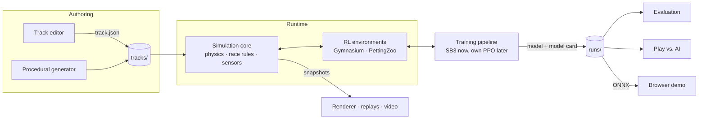
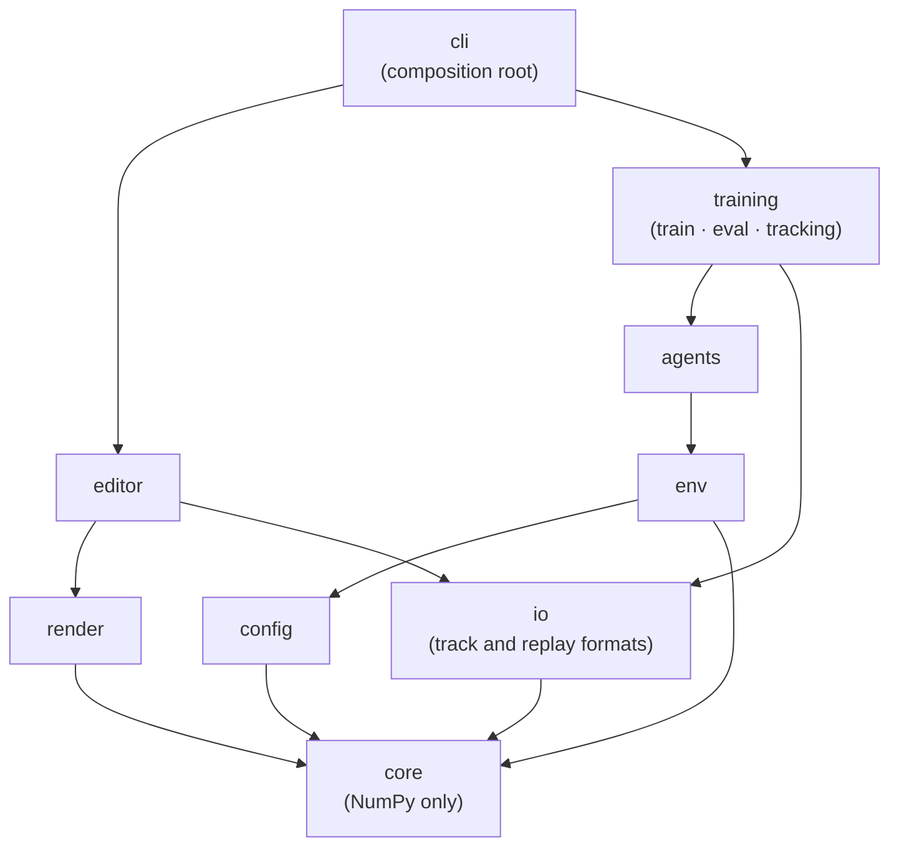
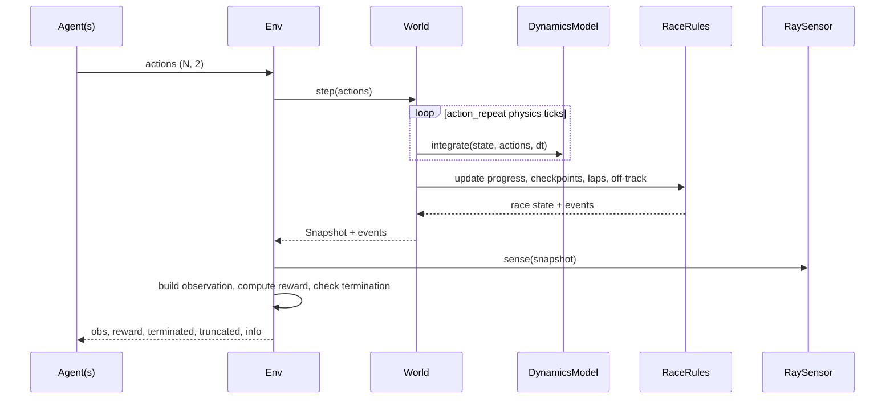

# Architecture

> **Status:** Draft v0.1 (2026-10-06). This document describes the target design. It changes
> through [ADRs](adr/); if the code and this document disagree, one of them has a bug.

> **In plain words:** The program is built like a building with floors. The bottom floor is
> the "physics engine": it moves the cars, counts laps, and measures how far each car is from
> the track edges, using nothing but math. Above it sit the parts that use it: the AI training
> gym, the screen drawing, the track editor, and the training tools. The top floor is the
> `racecar` command you type. Each floor may only use the floors below it, which keeps every
> part simple to test and easy to swap out. Unfamiliar terms are in the [glossary](glossary.md).

## 1. System overview

Every user-facing workflow sits on top of the same simulation core:

| Workflow         | Command (planned)               | What happens                                              | Milestone |
|------------------|---------------------------------|-----------------------------------------------------------|-----------|
| Design           | `racecar edit`                  | Build a track visually, validate it, save it as JSON      | M1        |
| Drive            | `racecar drive`                 | Drive a track with the keyboard, with lap timing          | M2        |
| Train            | `racecar train <config>`        | Train an RL agent into a self-describing run directory    | M4        |
| Evaluate / watch | `racecar eval`, `racecar replay` | Score agents, record replays, export video               | M4        |
| Race             | `racecar race --vs <model>`     | You vs. trained agents                                    | M5        |
| Browser          | GitHub Pages                    | Watch agents race in the browser                          | M6        |



## 2. Layers and dependency rules



Rules (enforced by [import-linter](https://import-linter.readthedocs.io/) in CI, see ticket M0-6):

1. **Dependencies point downward only.** Nothing imports from a layer above it.
2. **`core` depends only on the standard library and NumPy.** It does no I/O, has no
   rendering code and no global state. This keeps it fast to test, deterministic, and
   portable: it could run unchanged in a browser via Pyodide ([ADR-0003](adr/0003-layered-architecture-pure-core.md)).
3. **`env` and `render` are siblings.** The RL environment never imports pygame; training
   runs headless.
4. **Only `cli` wires concrete implementations together.** Everything else receives its
   dependencies through constructors, so tests can swap in fakes.
5. **Heavy dependencies are optional extras:** `render` (pygame), `train` (PyTorch,
   Stable-Baselines3, TensorBoard). `core` and `env` install in seconds in CI.

## 3. Package map

| Package             | Responsibility                                                     | Key types (planned)                                  |
|---------------------|--------------------------------------------------------------------|------------------------------------------------------|
| `core.geometry`     | Vectorized 2D math: projections, intersections, raycasts           | free functions over `(N, 2)` arrays                  |
| `core.track`        | Spline centerline, track model, validation, procedural generation  | `Track`, `ValidationIssue`, `TrackGenerator`         |
| `core.vehicle`      | Vehicle parameters and dynamics models                             | `VehicleParams`, `VehicleState`, `DynamicsModel`     |
| `core.race`         | Progress, checkpoints, laps, timing, off-track rules, collisions   | `RaceState`, `RaceRules`, `RaceEvent`                |
| `core.sensors`      | Raycast distance sensors                                           | `RaySensor`                                          |
| `core.world`        | Fixed-timestep simulation of N cars                                | `World`, `Snapshot`                                  |
| `config`            | Typed configuration (pydantic) to core dataclasses                 | `VehicleConfig`, `EnvConfig`, `TrainConfig`          |
| `io`                | Versioned file formats: tracks, replays, model cards               | `TrackFile`, `ReplayWriter`, `ModelCard`             |
| `env`               | Gymnasium / PettingZoo adapters, observations, rewards             | `RacingEnv`, `BatchedRacingEnv`, `ObservationSpec`   |
| `agents`            | Anything that maps observations to actions                         | `Agent`, `KeyboardAgent`, `SB3Agent`, `OnnxAgent`    |
| `training`          | Training runs, evaluation, experiment tracking                     | `TrainingRun`, `Evaluator`, `Tracker`                |
| `render`            | pygame rendering of snapshots, HUD, debug overlays, video export   | `Renderer`, `Camera`, `VideoWriter`                  |
| `editor`            | Track editor application (MVC with command pattern)                | `TrackDraft`, `EditorController`, `Command`          |
| `cli`               | `racecar` command-line entry points (Typer)                        | n/a                                                  |

## 4. Core domain

### 4.1 Units and conventions

- SI units everywhere: metres, seconds, radians, kilograms.
- World frame: x to the right, y up; yaw is counter-clockwise from +x.
- `float64` inside the simulation; `float32` at the RL boundary (observations, actions).
- State is stored as **struct-of-arrays**: one array per quantity, shaped `(N,)` or `(N, k)`,
  where `N` is the number of cars ([ADR-0005](adr/0005-batched-multi-car-simulation.md)).

### 4.2 Track

```
control points ──► centripetal Catmull-Rom (closed) ──► resample every Δs metres
  (x, y, width)                                        │
                                                       ▼
                     centerline samples: xy, s (arc length), tangent, normal, curvature, width
                                                       │
                       ┌───────────────────────────────┼─────────────────────────┐
                       ▼                               ▼                         ▼
              left/right boundaries          checkpoints every K m      start line + start grid
```

Only the control points are stored. Everything else is derived, so there is a single
source of truth ([ADR-0004](adr/0004-track-representation.md)). Driving direction is the
order of the control points. Track file, schema v1:

```json
{
  "schema_version": 1,
  "name": "First Circuit",
  "author": "Phonlakrit Lookyee",
  "control_points": [
    {"x": 0.0,   "y": 0.0,  "width": 12.0},
    {"x": 120.0, "y": 10.0, "width": 10.0},
    {"x": 160.0, "y": 90.0, "width": 10.0},
    {"x": 40.0,  "y": 120.0, "width": 14.0}
  ]
}
```

Validation returns a list of structured `ValidationIssue(severity, code, message, location)`
instead of raising, so the editor can highlight problems while you draw.

### 4.3 Vehicle

- **State:** `x, y, yaw, vx, vy, yaw_rate, steer_angle` (body-frame velocities).
- **Action:** two continuous values in `[-1, 1]`: `steer` and `pedal`
  (positive = throttle, negative = brake).
- **Actuators:** steering rate limit, motor force curve, braking force, aerodynamic drag,
  rolling resistance.
- **Dynamics models** sit behind a `DynamicsModel` protocol so they can be swapped in config:
  - `KinematicBicycle` (M2): simple and stable, good for the first agent.
  - `DynamicBicycle` (M2, P1): tire slip via a simplified Pacejka model, so drifting and
    understeer emerge naturally. Blends into the kinematic model at low speed to avoid the
    singularity at zero velocity.
- **Timing:** physics at 120 Hz with semi-implicit Euler; agents decide at 20 Hz
  (action repeat = 6). Both are configurable and recorded with every run.

### 4.4 Simulation step



### 4.5 Race rules

- **Progress:** each car is projected onto the centerline using a local search window around
  its previous position (amortized O(1) per car). This gives arc length `s`, lateral offset
  `d`, and heading error relative to the track.
- **Checkpoints** must be crossed in order. A lap only counts if every checkpoint was
  crossed, which blocks reverse-over-the-line and corner-cutting exploits (agents *will*
  find these).
- **Off-track policy** is configurable: `none | slowdown | reset | terminate`.
- **Events** (`LapCompleted`, `OffTrack`, `WrongWay`, `Collision`) are returned as plain
  data, not callbacks, so they are easy to log, test, and replay.

### 4.6 Sensors and observations

- **Raycasts:** `R` rays spread across a field of view return the distance to the nearest
  track boundary. A broad phase only tests boundary segments near the car's progress index,
  so cost is `O(N·R·w)` instead of `O(N·R·S)` for `S` total segments.
- **Observation features** are composable and normalized: rays, speed, lateral offset,
  heading error, yaw rate, previous action, and look-ahead curvature.
- An **`ObservationSpec`** (feature names, shapes, normalization, content hash) is saved with
  every trained model. Loading a model into an incompatible environment fails loudly
  instead of silently producing a bad driver.

### 4.7 Rewards

The reward is a weighted sum of components defined in config: progress along the track
(Δs), time penalty, off-track penalty, wrong-way penalty, action smoothness, and lap bonus.
Each component's value is reported separately in `info`, which makes reward tuning
debuggable instead of guesswork.

### 4.8 Environments

All three environments are thin adapters over the same `World`:

| Environment          | API                    | Cars                               | Milestone |
|----------------------|------------------------|------------------------------------|-----------|
| `RacingEnv`          | `gymnasium.Env`        | 1                                  | M3        |
| `BatchedRacingEnv`   | `gymnasium.vector.VectorEnv` | N independent "ghost" cars in one world: N parallel envs for roughly the cost of one | M3 |
| `MultiCarRacingEnv`  | `pettingzoo.ParallelEnv` | N cars that collide and race     | M7        |

### 4.9 Agents

```python
class Agent(Protocol):
    def reset(self, seed: int | None = None) -> None: ...
    def act(self, observations: NDArray[np.float32]) -> NDArray[np.float32]:
        """Map a batch of observations (n, obs_dim) to actions (n, 2)."""
```

Implementations: `KeyboardAgent` (M2), `SB3Agent` (M4), `OnnxAgent` (M6), `PPOAgent` (M8,
our own). Every saved model ships a **model card** (observation spec hash, action spec,
environment config, library versions, git SHA) that is checked on load.

### 4.10 Training pipeline

A run directory contains everything needed to reproduce or audit a result:

```
runs/2026-12-01_2130_ppo-first-lap/
├── config.yaml      # fully resolved config (defaults + file + CLI overrides)
├── meta.json        # git SHA, dirty flag, package versions, seeds, hardware, timings
├── checkpoints/     # periodic checkpoints + best model by evaluation score
├── tensorboard/     # training curves and custom racing metrics
├── eval/            # evaluation reports (JSON + Markdown) and videos
└── replays/         # recorded episodes
```

### 4.11 Rendering, replays and video

The renderer only reads `Snapshot`s and never touches simulation internals. One snapshot
stream feeds every output through a `SnapshotSink` protocol (observer pattern): the live
window, the replay recorder, the video writer, and later the web demo.

### 4.12 Track editor

- **Model:** `TrackDraft`, pure Python with no pygame, so it is unit-testable headless.
- **View:** pygame canvas that draws the spline, boundaries, and validation issues.
- **Controller:** turns input into `Command` objects (command pattern), which gives
  undo/redo for free.

Validation runs on every edit, so mistakes show up while you draw.

### 4.13 Browser demo (M6, open question)

Two candidates, to be decided by a spike (M6-1) and recorded as an ADR:

1. **Pyodide:** run the real Python `core` in WebAssembly, with onnxruntime-web for the
   policy. One physics implementation; slower first load.
2. **TypeScript port:** reimplement `core` in TS, with cross-language conformance tests
   against golden trajectories. Fast and small, but two implementations to keep in sync.

The NumPy-only rule for `core` keeps option 1 open.

## 5. Cross-cutting concerns

| Concern          | Approach                                                                                                       |
|------------------|----------------------------------------------------------------------------------------------------------------|
| Configuration    | Pydantic models + YAML; precedence: defaults < file < `--set key=value`; resolved config always saved ([ADR-0008](adr/0008-typed-configuration.md)). |
| Determinism      | No global RNG. Every component receives an `np.random.Generator`; child seeds come from `SeedSequence.spawn`. The simulation is bitwise reproducible on a given platform; GPU training reproducibility is best-effort and documented. |
| Versioned formats| Track files, replays, and model cards carry `schema_version`, with a migration registry for old versions.      |
| Errors           | Validation returns structured issues. I/O errors name the file and field. No bare `except`.                    |
| Logging          | Standard-library `logging` with structured context; Rich for CLI output.                                       |
| Performance      | Vectorize first (NumPy), measure (benchmarks in CI), then optimize hot spots (spatial hashing, Numba) behind unchanged interfaces. |

## 6. Testing strategy

| Level          | What it covers                                        | Tools                                      | Runs on      |
|----------------|-------------------------------------------------------|--------------------------------------------|--------------|
| Unit           | Geometry, dynamics, race rules, rewards               | pytest                                     | Every PR     |
| Property-based | Geometry invariants, physics stays finite and bounded | Hypothesis                                 | Every PR     |
| Contract       | Gymnasium / PettingZoo API compliance                 | `gymnasium.utils.env_checker`, PettingZoo `api_test` | Every PR |
| Equivalence    | Batched env ≡ N single envs; N=1 ≡ N=1024 per car     | pytest                                     | Every PR     |
| Regression     | Golden trajectories, determinism                      | pytest + `.npz` fixtures                   | Every PR     |
| Smoke          | Tiny end-to-end training run (about 2k steps, CPU)    | pytest (`slow` marker)                     | Every PR     |
| Benchmark      | Simulation and environment throughput                 | pytest-benchmark                           | `main`       |
| Visual         | Editor and renderer behaviour                         | Checklist in the PR template               | When touched |

## 7. Repository layout (target)

```
MLRacecar/
├── .github/            # CI workflows, issue and PR templates
├── configs/            # YAML configs: vehicle/, env/, train/
├── docs/               # vision, architecture, ADRs, roadmap, guides, experiment log
├── scripts/            # one-off and maintenance scripts (e.g. backlog seeding)
├── src/mlracecar/
│   ├── core/           # geometry, track, vehicle, race, sensors, world
│   ├── config/
│   ├── io/
│   ├── env/
│   ├── agents/
│   ├── training/
│   ├── render/
│   ├── editor/
│   └── cli.py
├── tests/
│   ├── unit/
│   ├── integration/
│   ├── regression/
│   └── benchmarks/
├── tracks/             # track JSON files (handmade + samples)
├── web/                # browser demo (M6)
├── pyproject.toml
└── uv.lock
```

`runs/` (training output) is git-ignored.

## 8. Open questions

| Question                                    | Decided in                 |
|---------------------------------------------|----------------------------|
| Browser runtime: Pyodide or TypeScript port | M6-1 spike, then ADR       |
| Replay format: `.npz` or MessagePack        | M4-6                       |
| Hot-path optimization: Numba or pure NumPy  | After benchmarks (M2-9, M3-5) |
| Opponent observations for multi-car racing  | M7-3                       |
