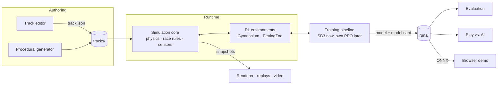
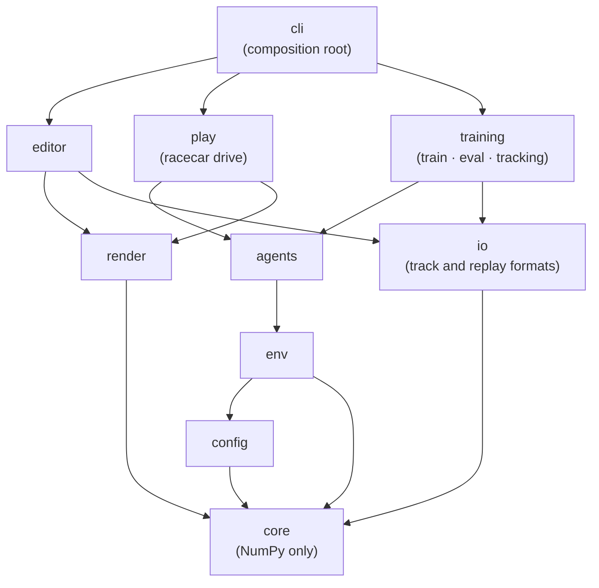
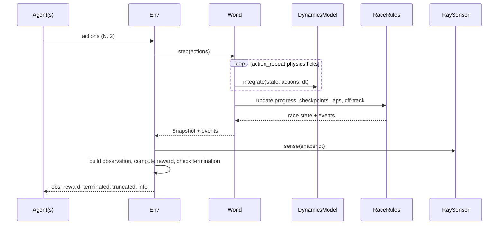

# Architecture

> **Status:** Draft v0.1 (2026-10-06). This document describes the target design. It changes
> through [ADRs](adr/README.md); if the code and this document disagree, one of them has a bug.

> **In plain words:** The program is built like a building with floors. The bottom floor is
> the "physics engine": it moves the cars, counts laps, and measures how far each car is from
> the track edges, using nothing but math. Above it sit the parts that use it: the AI training
> gym, the screen drawing, the track editor, and the training tools. The top floor is the
> `racecar` command you type. Each floor may only use the floors below it, which keeps every
> part simple to test and easy to swap out. Unfamiliar terms are in the [glossary](glossary.md).

## 1. System overview

Every user-facing workflow sits on top of the same simulation core:

| Workflow         | Command (planned)               | What happens                                              | Milestone |
|------------------|---------------------------------|-----------------------------------------------------------|-----------|
| Design           | `racecar edit`                  | Build a track visually, validate it, save it as JSON      | M1        |
| Drive            | `racecar drive`                 | Drive a track with the keyboard, with lap timing          | M2        |
| Train            | `racecar train <config>`        | Train an RL agent into a self-describing run directory    | M4        |
| Evaluate / watch | `racecar eval`, `racecar replay` | Score agents, record replays, export video               | M4        |
| Race             | `racecar race --vs <model>`     | You vs. trained agents                                    | M5        |
| Browser          | GitHub Pages                    | Watch agents race in the browser                          | M6        |



## 2. Layers and dependency rules



Rules (checked on every commit and in CI: the layer order and the pygame and PyTorch
boundaries by
[import-linter](https://import-linter.readthedocs.io/), configured in `pyproject.toml`, and the
core's import allow-list by `tests/unit/test_architecture.py`):

1. **Dependencies point downward only.** Nothing imports from a layer above it.
2. **`core` depends only on the standard library and NumPy.** It does no I/O, has no
   rendering code and no global state. This keeps it fast to test, deterministic, and
   portable: it could run unchanged in a browser via Pyodide ([ADR-0003](adr/0003-layered-architecture-pure-core.md)).
3. **`env` and `render` are siblings.** The RL environment never imports pygame; training
   runs headless. Only drawing code imports pygame (pygame-ce,
   [ADR-0012](adr/0012-pygame-ce-for-windows-and-drawing.md)): `render.drawing` and the
   editor's view and window.
4. **Only `cli` wires concrete implementations together.** Everything else receives its
   dependencies through constructors, so tests can swap in fakes.
5. **Heavy dependencies are optional extras:** `render` (pygame-ce), `train` (PyTorch built
   for CUDA 13.0, Stable-Baselines3, TensorBoard) or `train-cpu` (the same with CPU-only
   PyTorch, for CI). Only `agents` and `training` may import them, so `core`, `env`, and
   everything that draws install in seconds and run without them.

## 3. Package map

| Package             | Responsibility                                                     | Key types (planned)                                  |
|---------------------|--------------------------------------------------------------------|------------------------------------------------------|
| `core.geometry`     | Vectorized 2D math: projections, intersections, raycasts           | free functions over `(N, 2)` arrays                  |
| `core.track`        | Spline centerline, track model, validation, procedural generation  | `Track`, `ValidationIssue`, `TrackGenerator`         |
| `core.vehicle`      | Vehicle parameters and dynamics models                             | `VehicleParams`, `VehicleState`, `DynamicsModel`     |
| `core.race`         | Progress, checkpoints, laps, timing, off-track rules, collisions   | `RaceState`, `RaceRules`, `RaceEvent`                |
| `core.sensors`      | Raycast distance sensors                                           | `RaySensor`                                          |
| `core.world`        | Fixed-timestep simulation of N cars                                | `World`, `Snapshot`                                  |
| `config`            | Typed configuration (pydantic) to core dataclasses                 | `RacecarConfig`, `VehicleConfig`, `load_config`      |
| `io`                | Versioned file formats: tracks, replays, model cards               | `TrackFile`, `ReplayWriter`, `ModelCard`             |
| `env`               | Gymnasium / PettingZoo adapters, observations, rewards             | `RacingEnv`, `BatchedRacingEnv`, `ObservationSpec`   |
| `agents`            | Anything that maps observations to actions                         | `Agent`, `KeyboardAgent`, `SB3Agent`, `OnnxAgent`    |
| `training`          | Training runs, evaluation, experiment tracking                     | `TrainingRun`, `Evaluator`, `Tracker`                |
| `render`            | Drawing snapshots: track, kerbs, cars, HUD, debug overlays; video  | `Camera`, `RaceRenderer`, `Hud`, `VideoWriter`       |
| `editor`            | Track editor application (MVC with immutable drafts)               | `TrackDraft`, `EditorController`, `EditorWindow`     |
| `play`              | Driving yourself (`racecar drive`); racing agents later (M5)       | `DriveWindow`                                        |
| `cli`               | `racecar` command-line entry points (Typer)                        | n/a                                                  |

## 4. Core domain

### 4.1 Units and conventions

- SI units everywhere: metres, seconds, radians, kilograms.
- World frame: x to the right, y up; yaw is counter-clockwise from +x.
- `float64` inside the simulation; `float32` at the RL boundary (observations, actions).
- State is stored as **struct-of-arrays**: one array per quantity, shaped `(N,)` or `(N, k)`,
  where `N` is the number of cars ([ADR-0005](adr/0005-batched-multi-car-simulation.md)).

### 4.2 Track

```
control points ──► closed C2 cubic spline ──► resample every Δs metres
  (x, y, width)                                        │
                                                       ▼
                     centerline samples: xy, s (arc length), tangent, normal, curvature, width
                                                       │
                       ┌───────────────────────────────┼─────────────────────────┐
                       ▼                               ▼                         ▼
              left/right boundaries          checkpoints every K m      start line + start grid
```

Only the control points are stored. Everything else is derived, so there is a single
source of truth ([ADR-0004](adr/0004-track-representation.md)). Driving direction is the
order of the control points. Track file, schema v1:

```json
{
  "schema_version": 1,
  "name": "First Circuit",
  "author": "Phonlakrit Lookyee",
  "control_points": [
    {"x": 0.0,   "y": 0.0,  "width": 12.0},
    {"x": 120.0, "y": 10.0, "width": 10.0},
    {"x": 160.0, "y": 90.0, "width": 10.0},
    {"x": 40.0,  "y": 120.0, "width": 14.0}
  ]
}
```

The full format, with field rules and versioning, is in [Track file format](track-format.md).

Validation returns a list of structured `ValidationIssue(severity, code, message, location)`
instead of raising, so the editor can highlight problems while you draw.

### 4.3 Vehicle

- **State:** `x, y, yaw, vx, vy, yaw_rate, steer` (body-frame velocities), one array per
  quantity (`VehicleState`). The position is the centre of the wheelbase.
- **Action:** two continuous values in `[-1, 1]`: `steer` and `pedal`
  (positive = throttle, negative = brake). There is no reverse gear.
- **Actuators:** steering rate limit, motor force curve (full force up to the power limit,
  then `max_power / v`), braking force, aerodynamic drag, rolling resistance.
- **Dynamics models** sit behind a `DynamicsModel` protocol so they can be swapped in config:
  - `KinematicBicycle` (M2): simple and stable, good for the first agent. Its turn is limited
    by tyre grip, so the car runs wide when it's too fast for a corner
    ([ADR-0014](adr/0014-kinematic-car-model.md), [Car physics](vehicle-model.md)).
  - `DynamicBicycle` (M2, P1): tire slip via a simplified Pacejka model, so drifting and
    understeer emerge naturally. Blends into the kinematic model at low speed to avoid the
    singularity at zero velocity.
- **Timing:** physics at 120 Hz with semi-implicit Euler; agents decide at 20 Hz
  (action repeat = 6). Both are configurable and recorded with every run.

### 4.4 Simulation step



`World(track, model, timing, cars, rng)` is the only part that changes as the race goes on.
Each `step(actions)` holds every car's action for `action_repeat` physics steps and returns a
`Snapshot` (tick, time, and every car's state) whose arrays are read-only, so the renderer, a
replay, or the environment can keep it without copying. `reset(mask, start=...)` puts some
cars back on their own grid spots or at random places along the road, at rest, without
touching the others; random starts are the only use of the world's random generator. Cars
are ghosts until collisions arrive in M7.

### 4.5 Race rules

- **Progress:** each car is projected onto the centerline using a local search window around
  its previous position (amortized O(1) per car). This gives arc length `s`, lateral offset
  `d`, and heading error relative to the track, plus the distance driven since the start.
- **Checkpoints** are lines across the road that end at its edges, and must be crossed in
  order. A lap only counts if every checkpoint was crossed; crossing one backwards undoes
  crossing it. This blocks reverse-over-the-line and corner-cutting exploits (agents *will*
  find these). Lap and sector times are interpolated between updates.
  See [Race rules](race-rules.md).
- **Off track** means the car's centre is off the road. What happens then is configurable
  (`race.off_track`): `none | slowdown | reset | terminate`; `slowdown` is the default.
  **Wrong way** means moving backwards along the track faster than 1 m/s.
- **Events** (`LapCompleted`, `OffTrack`, `WrongWay`, `Collision`) are returned as plain
  data, not callbacks, so they are easy to log, test, and replay.

### 4.6 Sensors and observations

- **Raycasts** (`core.sensors.RaySensor`, [Sensors](sensors.md)): `R` rays spread across a
  field of view return the distance to the nearest track boundary. A broad phase only tests
  boundary segments near the car's progress index, so cost is `O(N·R·w)` instead of
  `O(N·R·S)` for `S` total segments. Within that window, segments are grouped into blocks with
  precomputed bounding circles that each ray tests first, and only segments whose endpoints
  straddle the ray's line get the exact intersection. The result is exact: it matches testing
  every segment.
- **Observation features** (`env.observations.ObservationBuilder`,
  [Observations](observations.md)) are composable and normalized: rays, speed, heading error
  (as sine and cosine), lateral offset, yaw rate, steering angle, previous action, and
  look-ahead curvature (the mean curvature of equal stretches ahead). Each can be switched off
  in config; they always appear in the same order, and unbounded ones are clipped to ±2.
- An **`ObservationSpec`** (feature names, labels, bounds, scaling constants, and a SHA-256
  digest of all of them) is saved with every trained model. Loading a model into an
  incompatible environment fails loudly instead of silently producing a bad driver.

### 4.7 Rewards

The reward (`env.rewards.RewardFunction`, [Rewards and episodes](rewards.md)) is a weighted
sum of components defined in config: progress along the track (Δs), time penalty, off-track
penalty, wrong-way penalty, action smoothness, and lap bonus. Weights are non-negative; each
component carries its own sign. The defaults use only progress (0.1 per metre) and the
off-track penalty (10). Each component's value is reported separately in `info`, which makes
reward tuning debuggable instead of guesswork.

Episodes end by `env.episodes.EpisodeRules`: leaving the road (`episode.end_off_track`,
independent of the race's own off-track policy) or being taken out by the race rules
**terminates**; the time limit (60 s) or being stuck (below 1 m/s for 5 s) **truncates**.

### 4.8 Environments

All three environments are thin adapters over the same `World`:

| Environment          | API                    | Cars                               | Milestone |
|----------------------|------------------------|------------------------------------|-----------|
| `RacingEnv`          | `gymnasium.Env`        | 1                                  | M3        |
| `BatchedRacingEnv`   | `gymnasium.vector.VectorEnv` | N independent "ghost" cars in one world: N parallel envs for roughly the cost of one | M3 |
| `MultiCarRacingEnv`  | `pettingzoo.ParallelEnv` | N cars that collide and race     | M7        |

`RacingEnv` (`env.racing`, [The RL environment](environment.md)) is registered as
`MLRacecar-v0`. Each step it calls `World.step`, then `RewardFunction`, `EpisodeRules`, and
`ObservationBuilder`; `reset(seed, options={track, start})` builds a fresh `World` from the
environment's seeded generator, so runs repeat exactly from a seed. Rendering is injected: the
environment depends only on a `Viewer` protocol, and the registration's entry point
(`play.environment.make_racing_env`) supplies `render.viewer.RaceViewer`, importing pygame
only when a render mode is requested. That keeps `env` free of `render` and pygame, as the
import-linter contracts require.

`BatchedRacingEnv` (`env.batched`) is the registration's vector entry point
(`gymnasium.make_vec(..., vectorization_mode="vector_entry_point")`). One `World` holds all
`num_envs` cars; every car starts as if alone (pole position via `World.grid`, or
`random_poses` from its own seeded generator, placed with `World.reset(mask, pose=...)`), so
its transitions equal a single `RacingEnv`'s bit for bit, which a test checks against
`SyncVectorEnv`. Both of Gymnasium's autoreset modes are supported: `NEXT_STEP` (default) and
`SAME_STEP` (`final_obs`/`final_info`, what Stable-Baselines3 expects). Restarted cars'
observations are built from `Snapshot.select`. At 64 cars it is about 15 times faster than
64 separate environments.

### 4.9 Agents

```python
class Agent(Protocol):
    def reset(self, seed: int | None = None) -> None: ...
    def act(self, observations: NDArray[np.float32]) -> NDArray[np.float32]:
        """Map a batch of observations (n, obs_dim) to actions (n, 2)."""
```

Implementations: `KeyboardAgent` (M2), `SB3Agent` (M4), `OnnxAgent` (M6), `PPOAgent` (M8,
our own). `KeyboardAgent` turns held keys into smooth steering (0.15 s to full lock, 0.1 s back
to straight) and an immediate pedal; the window tells it which keys are held, so it never
imports pygame. `racecar drive` (`play.drive.DriveWindow`) runs the race in real time, one
decision every 0.05 s, while drawing 60 frames a second with the car blended between decisions.

`SB3Agent` (`agents.sb3`, [Trained agents](agents.md)) wraps a Stable-Baselines3 model;
deterministic mode acts on the policy's mean, so the same observation always gives the same
action. Every saved model ships a **model card** (`io.model_card`: the observation spec's
description and digest, the action spec, the environment config, library versions, the git
commit) that is checked on load: a different digest is refused with every differing field
named (`env.observations.observation_differences`). `training.vec_env.SB3VecEnv` adapts
`BatchedRacingEnv` (in `SAME_STEP` mode) to SB3's `VecEnv`, with `terminal_observation` and
`TimeLimit.truncated`; its transitions equal SB3's `DummyVecEnv` of single environments.

### 4.10 Training pipeline

`racecar train` (`training.run.TrainingRun`, [Training](training.md)) trains SB3 PPO on
`SB3VecEnv` and writes a run directory with everything needed to reproduce or audit a result:

```
runs/2026-10-08_153012_technical-seed0/
├── config.yaml      # fully resolved config (defaults + file + CLI overrides)
├── meta.json        # status, git SHA + dirty flag, versions, seeds, track hash, hardware, sessions
├── checkpoints/     # step_N/ periodic, best/ by evaluation score, last/ for resuming (SB3Agent folders)
├── eval/            # evaluations.jsonl: one line per evaluation; reports (M4-5) and videos (M4-7)
├── tensorboard/     # training curves and custom racing metrics (M4-4)
└── replays/         # recorded episodes (M4-6)
```

Evaluation drives `eval_runs` deterministic episodes at once in a `BatchedRacingEnv`
(`training.evaluation.drive_test_runs`), from random starts whose seeds are fixed per run, so
scores are comparable across evaluations; the mean return is the score. Everything random is
seeded from `training.seed` (`set_random_seed`, `seed + i` per car), so a CPU run is bitwise
reproducible on one machine. Ctrl+C saves `checkpoints/last` and marks the run interrupted;
`--resume` continues to `training.steps` (episodes restart, so it isn't bitwise equal to an
uninterrupted run), refusing if the track file's hash changed.

### 4.11 Rendering, replays and video

The renderer only reads `Snapshot`s and never touches simulation internals: an import-linter
contract keeps `mlracecar.render` away from the world, the car models, and the race rules.
`Snapshot` and `RaceState` live in data-only modules (`core.snapshot`, `core.race.state`) for
that reason. One snapshot stream feeds every output through a `SnapshotSink` protocol (observer
pattern): the live window, the replay recorder, the video writer, and later the web demo.

`RaceRenderer` draws the track (with red and white kerbs on bends tighter than 100 m), the
cars, and a HUD for the followed car (speed, lap, current, last and best lap times, and
warnings). It has three cameras (follow a car, overview of the whole track, free pan and zoom)
and debug overlays that can be toggled: centerline, checkpoints (the followed car's next one
highlighted), velocity arrows, and sensor rays. `render(snapshot)` draws offscreen and returns
an RGB array, which works headless (SDL's dummy driver) for tests, CI, and video. With 16 cars
on the 3.5 km GP circuit a frame takes about 6 ms following a car and 9 ms for the overview,
all overlays on (`tests/benchmarks/test_render_speed.py`).

### 4.12 Track editor

- **Model:** `TrackDraft` (`mlracecar.editor.draft`), pure Python with no pygame, so it is
  unit-testable headless. Drafts are **immutable**: every edit returns a new draft, so undo/redo
  is a history of drafts ([ADR-0011](adr/0011-immutable-editor-drafts.md)).
- **View:** `EditorView` (`mlracecar.editor.view`) draws the grid, the road with its edges,
  start line and direction arrow (shared with the race window through `mlracecar.render`),
  the points, a status bar, and a help panel, onto any pygame surface.
- **Controller:** `EditorController` (`mlracecar.editor.controller`) turns input into draft
  edits and camera moves. It takes window pixels and converts them with an immutable `Camera`
  (`mlracecar.render.camera`), so every interaction is tested without pygame. A **click on the
  road inserts** a point into that stretch (refining a corner; a hollow dot under the cursor
  shows it); a **click anywhere else appends** a point after the last one (drawing a track is
  clicking around it). Sending *every* click to the nearest stretch fails when drawing: it
  misplaced 94 of 98 points of the GP circuit clicked in order. With the on-road rule, 1 of 98
  is misplaced (a hairpin dot 7 m from the previous one), and none with 2–3 dots per corner;
  **shift+click** always appends, for that case. Other input:
  drag a point to move it, right-click to delete it, right- or middle-drag to pan, the wheel to
  zoom around the cursor, shift+wheel to change the road width at a point, and **G** to snap
  to the grid.
- **Window:** `EditorWindow` (`mlracecar.editor.app`) is the only part that handles pygame
  events. It redraws only when something changed, so an idle editor uses no CPU. Its keyboard
  shortcuts are one table that also fills the help panel, so the help can't drift from the
  keys. `racecar edit [file]` opens it.
- **File:** `TrackDocument` (`mlracecar.editor.document`) knows the file and what was last
  saved; "unsaved changes" is just *draft on screen != draft saved*. Ctrl+S saves (asking for a
  file name the first time), Ctrl+Shift+S saves as, and closing with unsaved changes asks first.
  Tracks with errors can be saved, since a draft is work in progress, and the message says
  they can't be raced yet. Positions and widths are saved to the centimetre, so files stay
  readable (`-314.08`, not `-314.0837535325377`).
- **Undo:** `History` (`mlracecar.editor.history`) keeps up to 500 earlier drafts. The
  controller records one step per finished action: a click, a whole drag (with the point its
  click may have added), or a run of width changes at one point, notch by notch. Kept drafts
  drop their cached track (about 1.2 MB on a 3.5 km circuit, rebuilt in about 13 ms), so the
  whole history takes about a megabyte. Ctrl+Z undoes; Ctrl+Y or Ctrl+Shift+Z redoes. Saving
  isn't a step, though it may name the track after its file and round its numbers.

**Track problems show while you draw.** The checks run on a worker thread, newest draft first
([ADR-0013](adr/0013-track-checks-in-the-background.md)), so a 3.5 km track still drags at 60
frames per second. Each problem is marked where it is: a ring round a point, coloured road
edges along a stretch (plus a ring if it's too short to see), or a circle on a spot; red for
errors, orange for warnings. A compact list sits in the corner (I hides it), pointing at a
marker shows its full message, and the status bar says "ready to race" or why not.

### 4.13 Browser demo (M6, open question)

Two candidates, to be decided by a spike (M6-1) and recorded as an ADR:

1. **Pyodide:** run the real Python `core` in WebAssembly, with onnxruntime-web for the
   policy. One physics implementation; slower first load.
2. **TypeScript port:** reimplement `core` in TS, with cross-language conformance tests
   against golden trajectories. Fast and small, but two implementations to keep in sync.

The NumPy-only rule for `core` keeps option 1 open.

## 5. Cross-cutting concerns

| Concern          | Approach                                                                                                       |
|------------------|----------------------------------------------------------------------------------------------------------------|
| Configuration    | Pydantic models + YAML; precedence: defaults < file < `--set key=value`; resolved config always saved ([ADR-0008](adr/0008-typed-configuration.md), [Settings](configuration.md)). |
| Determinism      | No global RNG. Every component receives an `np.random.Generator`; child seeds come from `SeedSequence.spawn`. The simulation is bitwise reproducible on a given platform; GPU training reproducibility is best-effort and documented. |
| Versioned formats| Track files, replays, and model cards carry `schema_version`, with a migration registry for old versions.      |
| Errors           | Validation returns structured issues. I/O errors name the file and field. No bare `except`.                    |
| Logging          | Standard-library `logging` with structured context; Rich for CLI output.                                       |
| Performance      | Vectorize first (NumPy), measure (benchmarks in CI), then optimize hot spots (spatial hashing, Numba) behind unchanged interfaces. |

## 6. Testing strategy

| Level          | What it covers                                        | Tools                                      | Runs on      |
|----------------|-------------------------------------------------------|--------------------------------------------|--------------|
| Unit           | Geometry, dynamics, race rules, rewards               | pytest                                     | Every PR     |
| Property-based | Geometry invariants, physics stays finite and bounded | Hypothesis                                 | Every PR     |
| Contract       | Gymnasium / PettingZoo API compliance                 | `gymnasium.utils.env_checker`, PettingZoo `api_test` | Every PR |
| Equivalence    | Batched env ≡ N single envs; N=1 ≡ N=1024 per car     | pytest                                     | Every PR     |
| Regression     | Golden trajectories, determinism                      | pytest + `.npz` fixtures                   | Every PR     |
| Smoke          | Tiny end-to-end training run (about 2k steps, CPU)    | pytest (`slow` marker)                     | Every PR     |
| Benchmark      | Simulation and environment throughput                 | pytest-benchmark                           | `main`       |
| Visual         | Editor and renderer behaviour                         | Checklist in the PR template               | When touched |

## 7. Repository layout (target)

```
MLRacecar/
├── .github/            # CI workflows, issue and PR templates
├── configs/            # YAML settings; default.yaml lists every setting
├── docs/               # vision, architecture, ADRs, roadmap, guides, experiment log
├── scripts/            # one-off and maintenance scripts (e.g. backlog seeding)
├── src/mlracecar/
│   ├── core/           # geometry, track, vehicle, race, sensors, world
│   ├── config/
│   ├── io/
│   ├── env/
│   ├── agents/
│   ├── training/
│   ├── render/
│   ├── editor/
│   └── cli.py
├── tests/
│   ├── unit/
│   ├── integration/
│   ├── regression/
│   └── benchmarks/
├── tracks/             # track JSON files (handmade + samples)
├── web/                # browser demo (M6)
├── pyproject.toml
└── uv.lock
```

`runs/` (training output) is git-ignored.

## 8. Open questions

| Question                                    | Decided in                 |
|---------------------------------------------|----------------------------|
| Browser runtime: Pyodide or TypeScript port | M6-1 spike, then ADR       |
| Replay format: `.npz` or MessagePack        | M4-6                       |
| Hot-path optimization: Numba or pure NumPy  | After benchmarks (M2-9, M3-5) |
| Opponent observations for multi-car racing  | M7-3                       |
