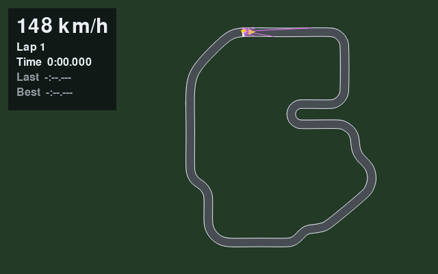

# MLRacecar

**Draw a race track. Watch an AI learn to master it. Then try to beat it.**

*The AI's first clean lap of the technical circuit, 30.3 s, after about a minute and a half of
training on a laptop CPU. The pink lines are the distance sensors it drives by.*

> **In plain words:** This is the documentation website for MLRacecar, a 2D racing game where
> you design tracks and an AI learns to drive them. Every page starts with a short plain-words
> summary; technical terms are explained in the [glossary](glossary.md).

MLRacecar is a top-down 2D racing simulator built from scratch in Python. It comes with a
visual track editor and a reinforcement-learning pipeline that teaches cars to drive any
track you design.

!!! info "Status"
    Milestones **M0 to M3** are done: the tracks and the editor, a drivable simulation, and the
    reinforcement-learning environment. In **M4** an AI now learns to lap a track, as above.
    Live progress is on the [project board](https://github.com/users/taofuuu/projects/3).

## Where to start

| If you want to…                                      | Read                                       |
|------------------------------------------------------|--------------------------------------------|
| Understand the goals and what "done" means           | [Vision](vision.md)                        |
| See how the system is built                          | [Architecture](architecture.md)            |
| Know *why* it's built that way                       | [Decision records](adr/README.md)          |
| See what's planned and when                          | [Roadmap](roadmap.md)                      |
| Look up a term                                       | [Glossary](glossary.md)                    |
| Browse the code's own documentation                  | [API reference](reference.md)              |
| Work on the code                                     | [Contributing guide](https://github.com/taofuuu/MLRacecar/blob/main/CONTRIBUTING.md) |

## Source code

[github.com/taofuuu/MLRacecar](https://github.com/taofuuu/MLRacecar) · MIT License
