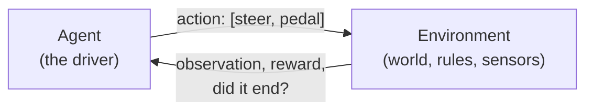

# RL fundamentals

> **In plain words:** Reinforcement learning (RL) teaches by trial and error. The AI drives,
> gets a score after every move, and slowly does more of what scored well. This page explains
> the handful of ideas behind that, each tied to the part of MLRacecar where it lives. It also
> lists the choices coming up when we build the AI's environment (M3), so you can make them
> knowing what each one changes. The questions at the end double as interview practice.

Every part this page describes now exists; the M3 tickets updated it with what was decided.

## 1. The loop: agent and environment

Everything in RL is one loop. The **agent** (the driver) looks at an **observation** and picks
an **action**. The **environment** (everything else: the car, the track, the rules) moves time
forward, then hands back the next observation and a **reward**, a number saying how good that
step was. Repeat.

In MLRacecar the pieces already exist, except the wrapper that ties them together:

| RL idea | In our code |
|---------|-------------|
| Agent | Anything with `act(observations) -> actions`: the `Agent` protocol in `agents/base.py`. You at the keyboard are one (`KeyboardAgent`); the scripted test driver is another; the trained network will be the third. |
| Environment's physics | `World.step(actions)` in `core/world.py`: moves every car one decision forward and returns a `Snapshot`. |
| What the agent sees | `ObservationBuilder` (`env/observations.py`, [Observations](observations.md)): the distance rays ([Sensors](sensors.md)) and a few more numbers. |
| The wrapper | `RacingEnv` (`env/racing.py`, [The RL environment](environment.md)): the standard Gymnasium interface, `reset() -> observation, info` and `step(action) -> observation, reward, terminated, truncated, info`. |

One step of the loop is one **decision**: 1/20 of a second. The physics runs 6 smaller steps
inside it (120 a second), with the action held the whole time (*action repeat*). Deciding 20
times a second is plenty for driving and makes learning easier: fewer decisions per lap means
each one matters more.

## 2. The formal version: an MDP

RL problems are described as a **Markov decision process** (MDP):

- **States** *s*: everything about the world right now.
- **Actions** *a*: what the agent can do.
- **Transitions**: what state comes next, given the state and the action (our physics).
- **Rewards** *r*: the score for each step.
- **Discount** γ (gamma): how much a reward later is worth compared to one now.

*Markov* means the next state depends only on the current state and action, not on the history.
Our simulation is Markov by construction: a `Snapshot` (every car's `VehicleState` and
`RaceState`) is all `World.step` needs.

**State vs. observation.** The agent doesn't get the full state; it gets an observation, a
selection of it. That makes our problem *partially observable*. It matters: if the
observation leaves out something the future depends on, the agent can't tell apart situations
that need different actions. Two examples from our car:

- **Speed.** The rays look the same at 50 and 150 km/h, but the braking point doesn't. Speed has
  to be in the observation.
- **Steering angle.** The front wheels can only turn so fast (`steer_rate`), so where they point
  now limits what happens next. The agent needs the current angle, or at least its last action.

**The discount.** The agent maximizes the **return**: the sum of rewards, each one shrunk by γ
for every step it lies in the future. With γ = 0.99, rewards fade out over about
1 / (1 − γ) = 100 steps, which is 5 seconds of racing at 20 decisions a second. That's roughly
how far ahead the agent "cares": enough to brake for the next corner, not enough to plan a
whole lap.

## 3. Observations: what the agent sees

The observation is a list of numbers, the same length every step, that goes into a neural
network. Two rules of thumb:

- **Relative to the car, never absolute.** "The edge is 4 m to my left" works on any track;
  "I am at x = 312, y = −80" only on the track it learned. We want the AI to drive tracks it has
  never seen (M5), so nothing in the observation names a place on the map.
- **Scaled to about −1…1** (*normalized*). Networks learn badly when one input is in the
  thousands and another in the thousandths. The rays already come normalized: distance divided
  by the range.

What our agent sees (decided in M3-2; the full reference, with how each input is scaled, is
[Observations](observations.md)):

| Input | Why it helps |
|-------|--------------|
| Ray distances (15) | Where the edges are: the road's shape near the car. |
| Speed | When to brake; how hard it can turn. |
| Heading (2: sine and cosine of the angle to the road) | Pointing along the road, or across it. |
| Lateral offset | Where it is across the road. |
| Yaw rate, steering angle | How it's turning now, and how fast it can change that. |
| Previous action (2) | Smooth driving; the steering limit. |
| Curvature ahead (8 stretches over 150 m) | Bends beyond the rays' 100 m, in time to brake from top speed (about 115 m). |

Curvature ahead is "map knowledge" that a real driver gets from memory of the track. It speeds
learning up a lot; whether it hurts driving unseen tracks is something we can measure later
(an *ablation*: train with and without it, compare). Every input can be turned off in the
settings for exactly that.

## 4. Actions: what the agent controls

Each car's action is two numbers, `[steer, pedal]`, each from −1 to 1 (`Agent.act`, checked by
`checked_actions` in `core/vehicle/dynamics.py`, which clips anything outside):

- `steer`: +1 is full left lock, −1 full right. The wheels move towards it at `steer_rate`.
- `pedal`: +1 is full throttle, −1 full braking, 0 coasting.

These are **continuous** actions, so the network outputs a *distribution*: for each number, a
mean and a spread (a Gaussian). Training samples from it, which is how the agent explores; a
finished agent can just use the mean. Using −1…1 instead of degrees and newtons keeps the
network's outputs in a comfortable range, and lets the same agent drive a different car.

## 5. Rewards: what the agent wants

The reward is the only way to tell the agent what we want, and it takes us **literally**: it
maximizes what we wrote, not what we meant. A reward that can be gamed will be (*reward
hacking*). That makes the reward the most important design choice in M3.

The terms we built (architecture §4.7; the details, with their settings, are on
[Rewards and episodes](rewards.md)). The reward is their weighted sum, and each term's points
are reported separately, so we can see which one drives the behaviour. We start with only
**progress** (10 m = 1 point) and the **off-track penalty** (−10); the others are built but
switched off, to reach for if watching the AI drive shows a problem:

| Term | What it encourages | How it can backfire |
|------|--------------------|---------------------|
| **Progress**: metres gained along the lap this step (`race.distance` grows) | Driving forwards, fast. It's *dense*: feedback every step, not just once a lap. | Counts metres, not legality: see the shortcut below. |
| **Time penalty**: a small constant cost per step | Finishing sooner; not dawdling. | Too big, and ending the episode early (crashing) looks attractive. |
| **Off-track penalty** | Staying on the road. | Too big, and the agent learns to stand still where it's safe. |
| **Wrong-way penalty** | Driving the right way round. | Rarely backfires; mostly redundant with progress (going backwards loses progress). |
| **Action smoothness**: cost for changing the action a lot between steps | Steady inputs instead of twitchy ones. | Too big, and the car won't turn in hard enough. |
| **Lap bonus**: a lump sum for a valid lap | Completing laps by the rules. | *Sparse* (rare), so it barely helps early learning on its own. |

**A trap we've already measured.** With the default off-track rule (`slowdown`: the grass costs
6 m/s every second), a scripted driver that takes corners too fast runs wide over the grass and
still finishes laps about **3 seconds sooner** than a careful one (technical track: 43.6 s
against 46.5 s; GP circuit: 92.4 s against 96.5 s), though its laps don't count. A
progress-only reward would teach exactly that. The fixes are a rule decision for **M3-3**: end
or reset the run when the car leaves the road (`terminate` / `reset`), slow it much harder on
the grass, or add an off-track penalty bigger than the time it saves. We measured each: only
ending the run, or a grass slowdown 7 times stronger, made the shortcut lose. **Decided:
leaving the road ends the run** while the AI trains (and costs 10 points); driving it
yourself keeps the gentle rule.

**Scale matters too.** PPO works best when returns are within a few hundred either way.
That's why progress is weighted 0.1: a lap of the technical track is worth about 110 points,
and a 60-second run a little more.

## 6. Episodes: when a run ends

An **episode** is one run, from `reset()` to the end. There are two very different ways to end,
and Gymnasium reports them separately:

- **Terminated:** the task reached a real end. Nothing can follow (say the car left the road
  under `off_track: terminate`). The future is worth exactly 0.
- **Truncated:** we stopped it for our own reasons, usually a time limit. The car could have
  kept driving, and the future was worth something.

Mixing them up quietly breaks learning. If a time limit is reported as *terminated*, the agent
learns that the moment the clock runs out is worthless, even though the car was flying along,
and its value estimates (section 7) go wrong near the limit. Gymnasium split the old single
`done` flag into these two in 2022 for exactly this reason.

In our code, `race.out` marks a car whose run is over (the `terminate` policy), and
`World.reset(mask, start=...)` restarts just those cars while the others keep going. The batched
environment ([many cars at once](environment.md#many-cars-at-once)) uses that to run 64
cars as 64 independent episodes in one world.

Decided in M3-3 (`env/episodes.py`): leaving the road **terminates** the run; the **time limit**
(60 s, about a lap and a quarter of the technical track) and being **stuck** (slower than 1 m/s
for 5 s) **truncate** it. Runs start on the grid (decided in M3-4). Random starts anywhere on
the lap are one setting away (`episode.start: random`): they let the agent practise every
corner from the beginning instead of mostly the first ones, so they're the first thing to try
if it learns the start of the lap much better than the end.

## 7. Policy and value

- The **policy** π(a | s) is the driver: the network that turns an observation into an action
  distribution. Training changes its weights.
- The **value function** V(s) estimates the return from here on, if the policy keeps driving:
  "how good is this situation?". It's a second network (or a second head on the same one).
- The **advantage** A(s, a) is how much better an action turned out than V expected. A positive
  advantage means "do that more often here"; a negative one means "less often".

A method with both is an **actor-critic**: the policy is the *actor*, the value function the
*critic* that judges it. PPO is one. The critic matters because a single episode's return is
very noisy (one lucky lap); comparing against V removes much of that noise. **GAE**
(generalized advantage estimation) blends short- and long-range estimates of the advantage;
its λ (0.95 by default) trades a little bias for much less noise.

## 8. PPO, and why it clips

**Policy gradient**, the basic idea: after collecting some driving, nudge the policy so actions
with positive advantage become more likely, and actions with negative advantage less likely.

**The problem.** The advantages are noisy estimates, and a nudge that's too big can wreck a
policy that was doing well. Worse, the collected data describes the *old* policy; the further
the new one drifts from it, the less that data says about the new one. Bigger steps learn
faster until, suddenly, they make everything worse, and the agent may never recover.

**PPO's fix** (Proximal Policy Optimization, 2017): for each collected action, compare how likely
it is under the new policy and under the old one, as the ratio

    r = π_new(a | s) / π_old(a | s)

and clip it to between 1 − ε and 1 + ε (ε = 0.2 by default) in the objective:

    L = min( r · A,  clip(r, 1 − ε, 1 + ε) · A )

In words: once an action's probability has moved 20% in the helpful direction, this batch of
data stops pushing it further. The policy can't run far on one batch's evidence, so PPO can
safely train several passes (*epochs*) over the same data. It gets most of the safety of
fancier "trust region" methods at the cost of one `min` and one `clip`. The `min` makes it a
pessimistic bound: the clip only ever removes incentive to move, never adds it.

One PPO iteration, as SB3 runs it:

1. **Collect:** drive `n_steps` decisions in each of the parallel environments (2,048 by
   default; our batched environment gives many cars at once).
2. **Estimate:** compute advantages with GAE and the critic.
3. **Learn:** `n_epochs` passes (10) over the data in minibatches (`batch_size` 64), minimizing
   the clipped policy loss, the critic's error, and minus a small entropy bonus (which rewards
   staying a little random, so it keeps exploring).

Other settings you'll meet: `learning_rate` (3e-4), `gamma` (0.99), `gae_lambda` (0.95),
`clip_range` (0.2), `ent_coef` (0.0). Defaults are a reasonable start; M4 tunes them.

## 9. What to watch while training

SB3 logs these every iteration (names as in its logger):

| Metric | What it tells you | Healthy looks like |
|--------|-------------------|--------------------|
| `rollout/ep_rew_mean` | Average return of recent episodes: the main sign of progress. | Rising, with noise. |
| `rollout/ep_len_mean` | Average episode length. | Depends on the rules: with `terminate`, rising means it stays on the road longer. |
| `train/approx_kl` | How far one update moved the policy. | Small, about 0.01–0.02. Spikes mean steps too big: lower the learning rate. |
| `train/clip_fraction` | Share of samples where the clip kicked in. | Roughly 0.1–0.3. Near 0: barely learning; very high: updates too aggressive. |
| `train/entropy_loss` | Minus the policy's randomness. | Creeps up slowly as it grows confident. A sudden jump early means it stopped exploring. |
| `train/explained_variance` | How well the critic predicts returns. | Heading towards 1. At or below 0, the critic is useless and learning stalls. |
| `train/value_loss` | The critic's error. | Falls, but it's in reward units, so its size depends on reward scale. |
| `train/std` | The spread of the action distribution. | Shrinks slowly. |
| `time/fps` | Decisions simulated and learned from per second. | As high as possible; the [speed table](https://github.com/taofuuu/MLRacecar#speed) says the simulation won't be the limit. |

Our own numbers matter more than any of these: laps completed, best valid lap time, share of
time off the road. And above all, **watch it drive**: a rising reward with a car cutting across
the grass is reward hacking, and only a video shows it.

## 10. Choices coming up

What each M3 ticket will need from you, with this page's sections as background:

| Ticket | The choice | Sections |
|--------|------------|----------|
| M3-2 (#27) observation | Decided: every input in, including curvature ahead, out to 150 m. | 2, 3 |
| M3-3 (#28) rewards and termination | Decided: progress (10 m = 1 point) and −10 for leaving the road, which also ends the run; runs stop after 60 s, or 5 s stuck. | 5, 6 |
| M3-4 (#29) `RacingEnv` | Decided: runs start on the grid. The track to train on is chosen in M4 (the plan says `technical.json`: a short lap means more laps per hour). | 1, 6 |
| M3-5 (#30) batched env | Built: one world for many cars, exactly like separate environments and about 15 times faster at 64 cars. How many cars to train with is chosen in M4. | 1, 8 |

## Further reading

- [OpenAI Spinning Up](https://spinningup.openai.com/en/latest/), especially the
  [introduction to RL](https://spinningup.openai.com/en/latest/spinningup/rl_intro.html) (parts
  1 to 3) and the [PPO page](https://spinningup.openai.com/en/latest/algorithms/ppo.html). The best
  short introduction.
- [Stable-Baselines3: PPO](https://stable-baselines3.readthedocs.io/en/master/modules/ppo.html),
  [Tips and tricks](https://stable-baselines3.readthedocs.io/en/master/guide/rl_tips.html), and
  the [logger's metrics](https://stable-baselines3.readthedocs.io/en/master/common/logger.html).
- Schulman et al., [Proximal Policy Optimization Algorithms](https://arxiv.org/abs/1707.06347)
  (2017), the PPO paper; and [High-Dimensional Continuous Control Using Generalized Advantage
  Estimation](https://arxiv.org/abs/1506.02438) (2015), the GAE paper.
- Huang et al., [The 37 Implementation Details of Proximal Policy
  Optimization](https://iclr-blog-track.github.io/2022/03/25/ppo-implementation-details/)
  (2022): what the paper leaves out. Essential for writing our own PPO in M8.
- [CleanRL's PPO](https://docs.cleanrl.dev/rl-algorithms/ppo/): the whole algorithm in one
  readable file.
- Gymnasium: the [Env API](https://gymnasium.farama.org/api/env/) and [handling time
  limits](https://gymnasium.farama.org/tutorials/gymnasium_basics/handling_time_limits/)
  (termination vs. truncation).
- Sutton and Barto, [Reinforcement Learning: An
  Introduction](http://incompleteideas.net/book/the-book-2nd.html), the textbook, free online.

## Check yourself

Try answering out loud before opening each one. These are also common interview questions.

??? question "What's the difference between a state and an observation? Give an example from this project."
    The state is everything about the world (every car's position, speed, steering angle, its
    race); the observation is the part the agent is given. Our agent will get rays and a few
    features, not the map coordinates. If the observation left out speed, two situations that
    need different braking would look the same.

??? question "Why does a progress-only reward risk teaching the car to cut across the grass here?"
    Progress counts metres along the lap, not whether they were legal. Under the default
    `slowdown` rule, running wide over the grass costs less time than braking properly, so a
    scripted driver doing it laps about 3 s faster. The agent would find the same trade. We end
    the run when the car leaves the road (plus a 10-point penalty), so it loses everything it
    would have scored afterwards. Putting the car back on the road wasn't enough: measured, the
    reckless driver still lapped 2 s faster.

??? question "Termination vs. truncation: what goes wrong if a time limit is reported as termination?"
    Termination tells the learner the future is worth 0. At a time limit the car could have
    kept going, so the value estimates near the limit are taught a false zero and the agent
    learns from a lie, typically getting worse near the end of episodes.

??? question "What does the critic do in PPO, and how can you tell it's working?"
    It estimates the return from each state, so each action can be judged against what was
    expected (the advantage) instead of against a noisy raw return. `explained_variance` going
    towards 1 says it's working; at or below 0 it's no better than guessing the average.

??? question "Why does PPO clip the probability ratio? What would happen without it?"
    The data was collected by the old policy and the advantages are noisy, so big updates are
    unreliable and can wreck a good policy. Clipping stops an action's probability being
    pushed more than ε (20%) away from the old policy's on one batch. Without it, several epochs
    over the same data would keep pushing the same actions further and further, often
    collapsing performance.

??? question "Training shows approx_kl around 0.2 and clip_fraction around 0.6. What's happening, and what do you try?"
    The policy moves far on every update: far beyond the usual 0.01–0.02 KL, with most samples
    clipped. Updates are too aggressive. Lower the learning rate, use fewer epochs, or set
    `target_kl` so SB3 stops an update early.

??? question "Why are actions −1…1 instead of degrees and newtons?"
    Networks output well-behaved numbers near that range, the Gaussian's spread means the same
    thing for both actions, and the same agent can drive a car with a different steering lock or
    engine: the car turns −1…1 into its own limits.

??? question "Why does γ = 0.99 mean the agent plans about 5 seconds ahead?"
    Rewards fade by a factor γ per step, so they matter for about 1 / (1 − γ) = 100 steps, and
    100 decisions at 20 a second is 5 seconds: enough to set up the next corner.
