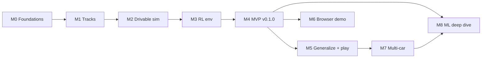

# Roadmap

> **In plain words:** The work is split into 9 stages (M0–M8). Each stage ends with something
> you can show someone. The first five stages, until early December, get us to the main goal:
> an AI that drives your track. Later stages are sketched roughly and get detailed when we
> reach them.

Every milestone ends with something you can **demo**. M0–M4 (the MVP) are planned at ticket
level; M5–M8 are planned at epic level and get refined when we reach them (rolling-wave
planning). Live status lives on the [GitHub Project board](https://github.com/users/taofuuu/projects/3). This page is the big picture.

## Milestones

| Milestone | Theme                 | Demo at the end                                         | Release | Target          |
|-----------|-----------------------|---------------------------------------------------------|---------|-----------------|
| **M0**    | Foundations           | A PR with green CI on Windows + Linux                   | n/a     | 2026-10-13      |
| **M1**    | Tracks                | Build a new track in the editor in under 5 minutes      | n/a     | 2026-10-27      |
| **M2**    | Drivable simulation   | Drive your own track with the keyboard, set a lap time  | n/a     | 2026-11-10      |
| **M3**    | RL environment        | Gymnasium env + throughput benchmarks                   | n/a     | 2026-11-24      |
| **M4**    | MVP: First lap        | GIF of the trained agent lapping your track             | v0.1.0  | 2026-12-08      |
| [**M5**](https://github.com/taofuuu/MLRacecar/milestone/6)    | Generalize and play   | You vs. AI on a track it has never seen                 | v0.2.0  | ~Jan 2027       |
| [**M6**](https://github.com/taofuuu/MLRacecar/milestone/7)    | Browser demo          | Public link: watch the agent race in the browser        | v0.3.0  | ~Feb 2027       |
| [**M7**](https://github.com/taofuuu/MLRacecar/milestone/8)    | Multi-car racing      | Six-car self-play race with overtakes                   | v0.4.0  | ~Mar 2027       |
| [**M8**](https://github.com/taofuuu/MLRacecar/milestone/9)    | ML deep dive          | Own PPO vs. SB3, ablations, technical write-up          | v1.0.0  | ~Apr–May 2027   |

Targets assume 5–10 hours per week. Sizes (S/M/L) measure
relative complexity, not hours. After M0 we recalibrate the dates from actual velocity. If a
milestone is at risk, `priority:P1` and `priority:P2` tickets get cut first.

The tables below list each milestone's tickets: key, ticket, type, priority, size.

## M0: Foundations

| Key  | Ticket                                            | Type     | Pri | Size |
|------|---------------------------------------------------|----------|-----|------|
| [M0-1](https://github.com/taofuuu/MLRacecar/issues/1) | Initialize repository and project metadata        | chore    | P0  | S    |
| [M0-2](https://github.com/taofuuu/MLRacecar/issues/2) | Scaffold the Python package with uv               | chore    | P0  | S    |
| [M0-3](https://github.com/taofuuu/MLRacecar/issues/3) | Configure linting, formatting, and type checking  | chore    | P0  | S    |
| [M0-4](https://github.com/taofuuu/MLRacecar/issues/4) | Set up the test framework                         | test     | P0  | S    |
| [M0-5](https://github.com/taofuuu/MLRacecar/issues/5) | CI pipeline on GitHub Actions                     | chore    | P0  | M    |
| [M0-6](https://github.com/taofuuu/MLRacecar/issues/6) | Enforce architecture boundaries with import-linter | chore   | P0  | S    |
| [M0-7](https://github.com/taofuuu/MLRacecar/issues/7) | GitHub workflow conventions and board automation  | chore    | P0  | S    |
| [M0-8](https://github.com/taofuuu/MLRacecar/issues/8) | Documentation site with MkDocs Material           | docs     | P1  | M    |

## M1: Tracks

| Key  | Ticket                                          | Type    | Pri | Size |
|------|-------------------------------------------------|---------|-----|------|
| [M1-1](https://github.com/taofuuu/MLRacecar/issues/9) | Vectorized 2D geometry primitives               | feature | P0  | M    |
| [M1-2](https://github.com/taofuuu/MLRacecar/issues/10) | Closed C2 cubic spline centerline (ADR-0010) | feature | P0 | M    |
| [M1-3](https://github.com/taofuuu/MLRacecar/issues/11) | Track model: boundaries, checkpoints, start grid | feature | P0 | M    |
| [M1-4](https://github.com/taofuuu/MLRacecar/issues/12) | Track validation rules                          | feature | P0  | M    |
| [M1-5](https://github.com/taofuuu/MLRacecar/issues/13) | Versioned JSON track file format                | feature | P0  | S    |
| [M1-6](https://github.com/taofuuu/MLRacecar/issues/14) | Track editor v1                                 | feature | P0  | L    |
| [M1-7](https://github.com/taofuuu/MLRacecar/issues/15) | Editor undo/redo                                | feature | P1  | M    |
| [M1-8](https://github.com/taofuuu/MLRacecar/issues/16) | Track format and editor user guide              | docs    | P1  | S    |
| [M1-9](https://github.com/taofuuu/MLRacecar/issues/79) | Round a corner to a chosen radius               | feature | P1  | M    |

## M2: Drivable simulation

| Key  | Ticket                                               | Type    | Pri | Size |
|------|------------------------------------------------------|---------|-----|------|
| [M2-1](https://github.com/taofuuu/MLRacecar/issues/17) | Typed configuration system                           | feature | P0  | M    |
| [M2-2](https://github.com/taofuuu/MLRacecar/issues/18) | Vehicle model: kinematic bicycle                     | feature | P0  | M    |
| [M2-3](https://github.com/taofuuu/MLRacecar/issues/19) | Vehicle model: dynamic bicycle with tire slip        | feature | P1  | L    |
| [M2-4](https://github.com/taofuuu/MLRacecar/issues/20) | Simulation world with a fixed-timestep loop          | feature | P0  | M    |
| [M2-5](https://github.com/taofuuu/MLRacecar/issues/21) | Race rules: progress, checkpoints, laps, off-track   | feature | P0  | L    |
| [M2-6](https://github.com/taofuuu/MLRacecar/issues/22) | pygame renderer with HUD and debug overlays          | feature | P0  | L    |
| [M2-7](https://github.com/taofuuu/MLRacecar/issues/23) | Agent interface and keyboard driving                 | feature | P0  | M    |
| [M2-8](https://github.com/taofuuu/MLRacecar/issues/24) | Determinism and golden-trajectory regression tests   | test    | P0  | S    |
| [M2-9](https://github.com/taofuuu/MLRacecar/issues/25) | Simulation performance benchmarks                    | test    | P1  | S    |

## M3: RL environment

| Key  | Ticket                                   | Type    | Pri | Size |
|------|------------------------------------------|---------|-----|------|
| [M3-1](https://github.com/taofuuu/MLRacecar/issues/26) | Raycast distance sensors                 | feature | P0  | M    |
| [M3-2](https://github.com/taofuuu/MLRacecar/issues/27) | Composable observation builder           | feature | P0  | M    |
| [M3-3](https://github.com/taofuuu/MLRacecar/issues/28) | Reward components and termination rules  | feature | P0  | M    |
| [M3-4](https://github.com/taofuuu/MLRacecar/issues/29) | Gymnasium single-agent RacingEnv         | feature | P0  | M    |
| [M3-5](https://github.com/taofuuu/MLRacecar/issues/30) | Batched vectorized environment           | feature | P0  | L    |
| [M3-6](https://github.com/taofuuu/MLRacecar/issues/31) | RL fundamentals guide for this project   | docs    | P1  | S    |

## M4: MVP, first lap (v0.1.0)

| Key  | Ticket                                            | Type     | Pri | Size |
|------|---------------------------------------------------|----------|-----|------|
| [M4-1](https://github.com/taofuuu/MLRacecar/issues/32) | Training dependencies with CUDA support           | chore    | P0  | S    |
| [M4-2](https://github.com/taofuuu/MLRacecar/issues/33) | Stable-Baselines3 agent adapter with model cards  | feature  | P0  | S    |
| [M4-3](https://github.com/taofuuu/MLRacecar/issues/34) | Reproducible training pipeline                    | feature  | P0  | L    |
| [M4-4](https://github.com/taofuuu/MLRacecar/issues/35) | Experiment tracking with TensorBoard              | feature  | P0  | M    |
| [M4-5](https://github.com/taofuuu/MLRacecar/issues/36) | Evaluation harness                                | feature  | P0  | M    |
| [M4-6](https://github.com/taofuuu/MLRacecar/issues/37) | Replay recording and playback                     | feature  | P0  | M    |
| [M4-7](https://github.com/taofuuu/MLRacecar/issues/38) | Video and GIF export                              | feature  | P1  | S    |
| [M4-8](https://github.com/taofuuu/MLRacecar/issues/39) | Train the first agent to lap your track           | research | P0  | L    |
| [M4-9](https://github.com/taofuuu/MLRacecar/issues/40) | README v1 and release v0.1.0                      | docs     | P0  | M    |

## M5–M8: epic level

| Milestone | Tickets |
|-----------|---------|
| [**M5**](https://github.com/taofuuu/MLRacecar/milestone/6) Generalize and play | Procedural track generator · Multi-track training + held-out eval · Curriculum learning (P1) · Domain randomization (P2) · Play against the AI · Ghost laps (P1) · Release v0.2.0 |
| [**M6**](https://github.com/taofuuu/MLRacecar/milestone/7) Browser demo        | Spike: Pyodide vs. TypeScript runtime · ONNX export + parity test · Web demo app · GitHub Pages deploy · Release v0.3.0 |
| [**M7**](https://github.com/taofuuu/MLRacecar/milestone/8) Multi-car racing    | Car-to-car collisions · PettingZoo multi-agent env · Opponent-aware observations · Self-play training · Race mode (P1) · Release v0.4.0 |
| [**M8**](https://github.com/taofuuu/MLRacecar/milestone/9) ML deep dive        | PPO from scratch · Benchmark vs. SB3 (multi-seed, CIs) · Optuna sweeps (P1) · Ablation study · SAC comparison (P1) · Technical write-up · Release v1.0.0 |

Each ticket links to its GitHub issue, which holds the tasks, acceptance criteria, and dependencies.
The issues were created from [`scripts/backlog/backlog.toml`](https://github.com/taofuuu/MLRacecar/blob/main/scripts/backlog/backlog.toml), the record of the initial plan;
GitHub is the source of truth from here on.
